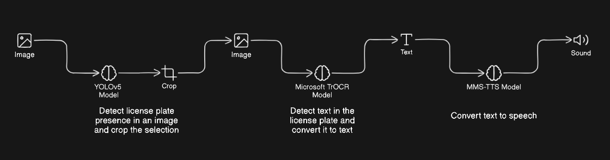

# License Plate Recognition App

This web application allows users to upload images containing license plates, perform license plate detection and recognition, and convert the recognized text into audio.

## Overview

The app utilizes computer vision models for license plate detection (YOLOv5) and optical character recognition (TR-OCR) to extract text from license plate images. Additionally, it employs a text-to-speech model (VITS) to convert the recognized text into audio, providing an accessible user experience.



## Features

- Upload images containing license plates.
- Detect license plates in the uploaded images.
- Recognize text from the detected license plates.
- Convert the recognized text into audio for accessibility.

## Installation

To run the app locally, follow these steps:

1. Clone the repository:

    ```bash
    git clone https://github.com/Amine-Alami/H3MachineLearning_2.git
    ```

2. Navigate to the project directory:

    ```bash
    cd H3MachineLearning_2
    ```

3. Install the required dependencies:

    ```bash
    pip install -r requirements.txt
    ```

## Usage

To launch the app, run the following command:

```bash
streamlit run app.py
```

## Dependencies

The app relies on the following libraries and frameworks:

- [Streamlit](https://streamlit.io/)
- [PIL (Python Imaging Library)](https://python-pillow.org/)
- [Transformers (Hugging Face)](https://huggingface.co/transformers/)
- [PyTorch](https://pytorch.org/)
- [YOLOv5](https://github.com/ultralytics/yolov5)

## Testing

You can test the app [here](https://huggingface.co/spaces/Amine-0047/license_plate_detection) on the Hugging Face Spaces platform.


